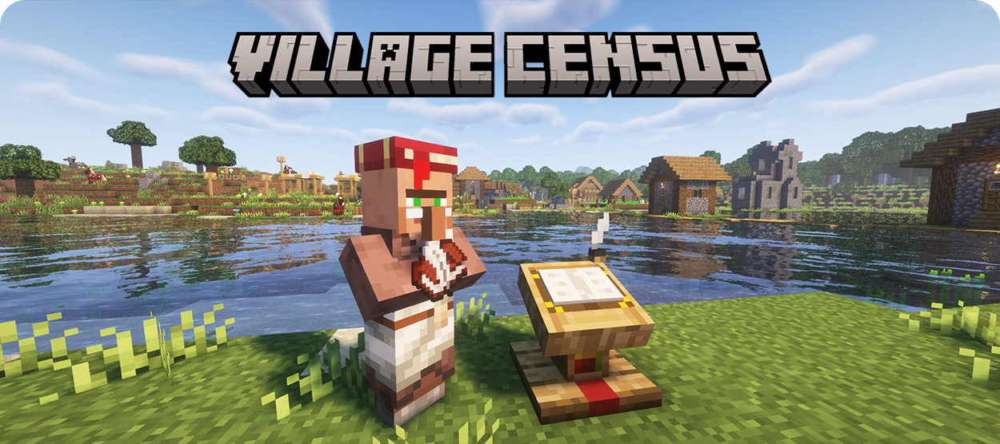
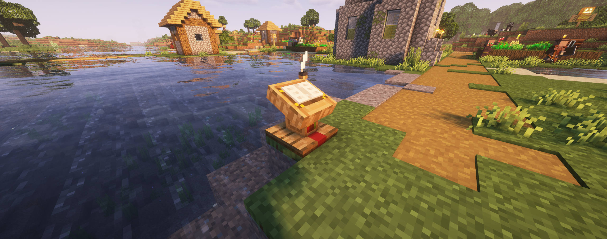
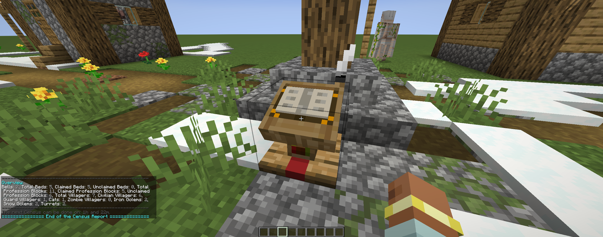
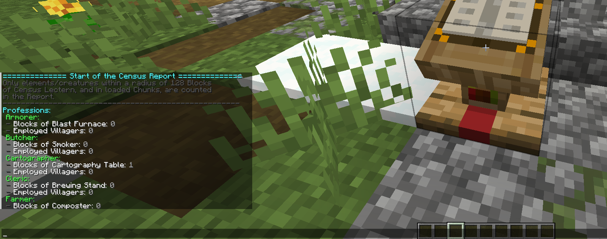
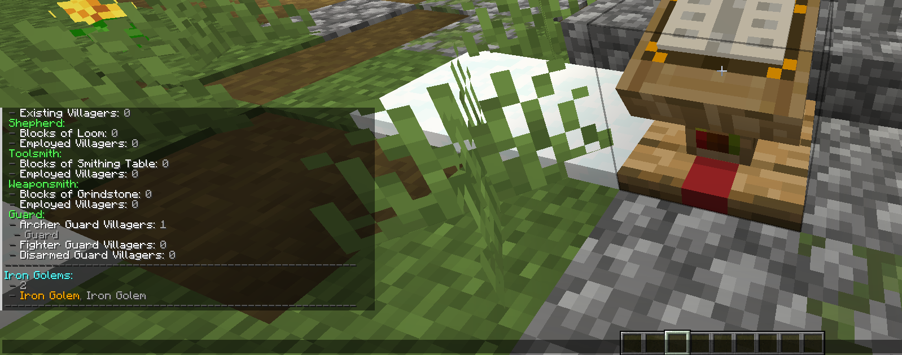
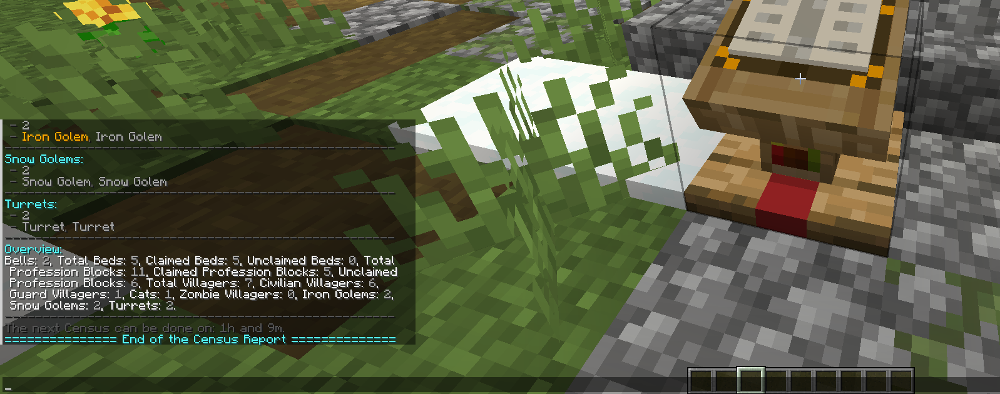
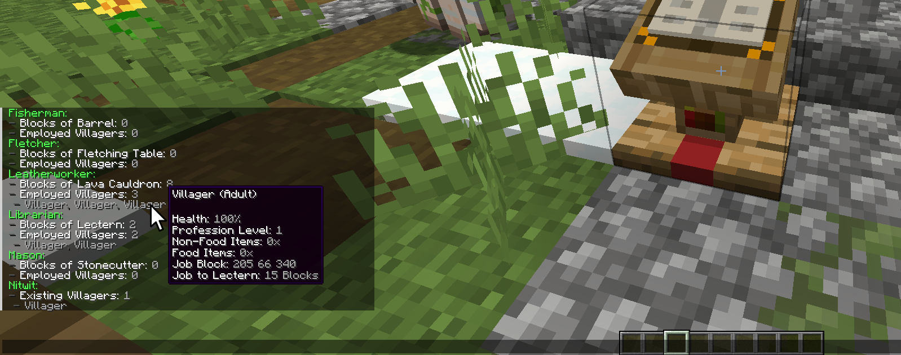

    
      
    To download this mod's JAR file, go to the folder corresponding to your Minecraft version, in this Repository, like "Forge-XX.XX.XX-JARs". All JAR versions of this mod will be located there.

# About this Mod

There are times when we settle in a Village and end up being the "Mayor" of that Village, managing it, taking care of its security, infrastructure, and of course, the Villagers. The problem is that over time, it becomes very easy to get lost amidst so many elements. It gets tedious to keep counting how many Villagers there are, what Professions exists, if there are enough Iron Golems, the health of the Villagers, etc.

This mod was created to solve this problem! Its function is to provide you with a simple and detailed report, informing you of EVERYTHING useful you need to know about a Village. The report includes things like the number of Villagers, Professions and their employees, the number of Iron Golems, additional information about the members and objects of the Village, etc. Keep reading to delve into the details!

To begin, you will need a block introduced by this mod, called "Census Lectern". The "Census Lectern" is the block that analyzes and conducts the Village Census and delivers the report to you. It conducts the Census within a radius of 128 Blocks (in all directions from the "Census Lectern"), so it should be placed as close as possible to the center of your Village.

Once the "Census Lectern" is positioned, you just need to click on it with the `Right Button` of Mouse. By doing this, the report will be printed in your Chat.

> [!NOTE]
> Sometimes, you may need to wait 1 in-game day before requesting a report, as the game sometimes takes a while to store information about the Village you are in.

When you interact with the Census Lectern, you will soon see an Overview report in your Chat. The Overview will only show you the Member and Object counts of interest in your Village. This way you have a quick summary to see quick information about your Village. In the Overview, you will see exactly the following:

- Bell Count
- Total Beds Count
- Claimed Beds Count
- Unclaimed Beds Count
- Profession Blocks Count
- Claimed Profession Blocks Count
- Unclaimed Profession Blocks Count
- Total Villagers Count
- Total Civilian Villagers Count (Villagers padrões, do Vanilla e de outros Mods)
- Total Guard Villagers Count (Villagers Guardas, do mod "<a href="https://www.curseforge.com/minecraft/mc-mods/guard-villagers">Guard Villagers</a>")
- Cats Count
- Zombie Villagers Count
- Iron Golems Count
- Snow Golems Count
- Turrets Count (For now, only the Towers from mod "<a href="https://www.curseforge.com/minecraft/mc-mods/vounierns-turrets">Vouniern's Turrets</a>" are being counted)

If you want to see more details about your Village, simply open your Chat and scroll up through your message history. Doing so will show you the rest of the report. In the rest of the report, you will see exactly the following:

- Armorer Profession
  - Count of "Blast Furnace" Blocks
  - List of Employeds
- Butcher Profession
  - Count of "Smoker" Blocks
  - List of Employeds
- Cartographer Profession
  - Count of "Cartography Table" Blocks
  - List of Employeds
- Cleric Profession
  - Count of "Brewing Stand" Blocks
  - List of Employeds
- Farmer Profession
  - Count of "Composter" Blocks
  - List of Employeds
- Fisherman Profession
  - Count of "Barrel" Blocks
  - List of Employeds
- Fletcher Profession
  - Count of "Fletching Table" Blocks
  - List of Employeds
- Leatherworker Profession
  - Count of "Cauldron" Blocks
  - List of Employeds
- Librarian Profession
  - Count of "Lectern" Blocks
  - List of Employeds
- Mason Profession
  - Count of "Stonecutter" Blocks
  - List of Employeds
- Shepherd Profession
  - Count of "Loom" Blocks
  - List of Employeds
- Toolsmith Profession
  - Count of "Smithing Table" Blocks
  - List of Employeds
- Weaponsmith Profession
  - Count of "Grindstone" Blocks
  - List of Employeds
- &lt;Modded&gt; Professions
  - Count of &lt;Modded Profession&gt; Blocks
  - List of Employeds
- Nitwits
  - List of Nitwits
- Unemployeds
  - List of Unemployeds
- Guard Profession
  - List of Archers
  - List of Figters
  - List of Disarmeds
- Iron Golems
  - Count of Iron Golems
  - List of Iron Golems
- Snow golem
  - Count of Snow Golems
  - List of Snow Golems
- Turrets
  - Count of Turrets
  - List of Turrets

The lists, in the more detailed part of the report, like displayed above, display each of the members. The name displayed is always the Member current name. For example, if a Villager doesn't have a name, he will appear as "Villager", but if he have a name assigned using a Nametag, and you name him as "Fred", then he will appear with the name of "Fred" in the report.

Additionally, each of the listed Members (such as Villagers, Golems, etc.) or listed Objects (Towers) will appear in Gold if they have 80% HP or less. If they have 50% HP or less, they will appear in Red. In the case of Guards, they will also appear with a Gold Asterisk if they have any equipment with 35% durability or less. If the durability of any equipment is 15% or less, then the Asterisk will appear in Red.

You can also hover your Mouse over Members or Objects that appear listed in the detailed report. By doing so, you will be able to see additional information. For Towers and Golems, you will see the current Integrity (HP), and for Villagers and Village Guards, you will be able to see their Age, HP, Profession Block coordinates, Equipment, Equipment durability, etc. If you click on a Member or Object, it will receive a Glow effect, allowing you to see that Member/Object through walls during ~8 seconds!

That's all. Hopefully, the Village management experience will be greatly improved with the help of this mod!

# Compatibility

This mod requires Minecraft Java with Forge Mod Loader installed. You can see the supported Minecraft versions in the folders of this Repository.

Minimum required Forge version:
- For Minecraft 1.20.1 is 47.2.0

# Support projects like this

If you liked the Village Census and found it useful for your, please consider making a donation (if possible). This would make it even more possible for me to create and continue to maintain projects like this, but if you cannot make a donation, it is still a pleasure for you to use it! Thanks! 😀

 

    

